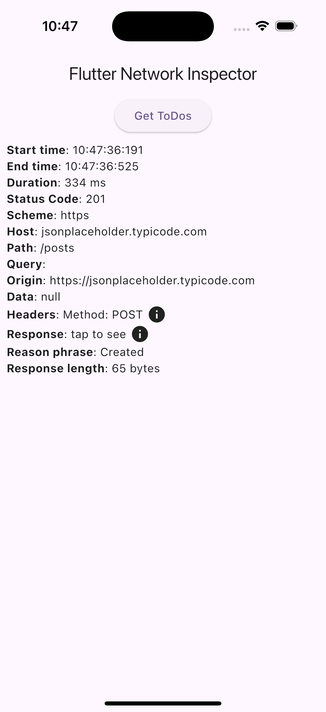

This package helps you to monitor networks calls done using the http package with in the app.

## Features



## Getting started

Create a client for your network calls, which is an object of FNIClient.
Then use this client to do all network calls.

```dart
 final client = FNICLient();

 final postResponse = await client.post(
    Uri.parse('https://jsonplaceholder.typicode.com/posts'),
    headers: {'Content-Type': 'application/json'},
    body: '{"title": "foo", "body": "bar", "userId": 1}',
 );
 doLog('Final Response: ${postResponse.body}');
```

## Usage

```dart
 final client = FNICLient();

 final postResponse = await client.post(
    Uri.parse('https://jsonplaceholder.typicode.com/posts'),
    headers: {'Content-Type': 'application/json'},
    body: '{"title": "foo", "body": "bar", "userId": 1}',
 );
 doLog('Final Response: ${postResponse.body}');
```


# flutter_network_inspector
# flutter_network_inspector
